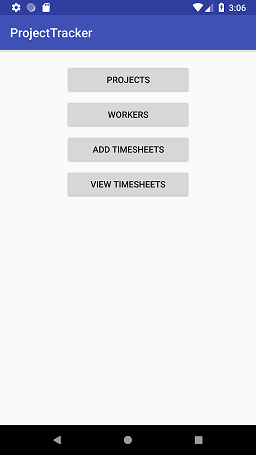
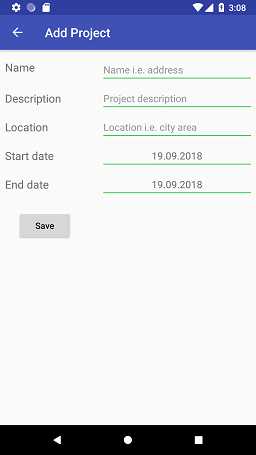
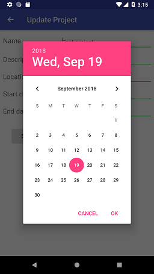
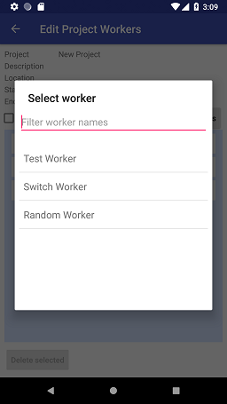
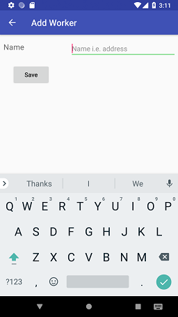
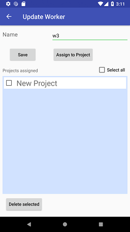
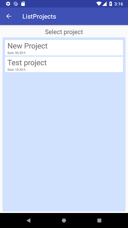

# Project Tracker
* mobile application to keep track of project persons hours.
* Project and worker amount totally customizable
* Timesheet values are currently inputed in format 1.5 (=1 h 30 min) and 1.25 (=1h 15min).

## **App views**
1. **Main View**  
   
   
2. **Projects View**  
      
	  
   2.1 **Add Project View**  
      
	  
      2.1.1 **Change Project Dates**  
	     
		 
   2.2. **View Project View**  
      
	  
   2.3 **Update Project View**  
      
	  
      2.3.1 **Change Project Dates**  
	     
		 
   2.4 **Assign Project Workers**  
      
	  
3. **Workers View**  
   
   
   3.1 **Add Worker View**  
      
	  
   3.2 **View Or Edit Worker View**  
      
	  
   3.3 **Assign Worker Projects**  
      
	  
4. **Add Timesheets View**  
   
   
   4.1 **Add Project Timesheet View**  
      
	  
   4.2 **Change Project Timesheet Date View**  
      
	  
5. **View Timesheets View**  
   

## **Important TODO-list**
- [ ] Timesheet Project summary view(s) by Month, Week, Day...
- [ ] Timesheet Worker summary view(s) by Month, Week, Day...
- [ ] Opened summaryview sharing in *.csv format (send to email for example).
- [ ] Add a login screen to login with password which can be generated by first time use.
- [ ] Add a settings page to the application (to change language for example)
- [ ] Setup a settings file (in sqlite db or stand-alone-json-file)
- [ ] Date object displaying by culture settings.
- [ ] Multilanguage support by changing text lookup to strings.xml
